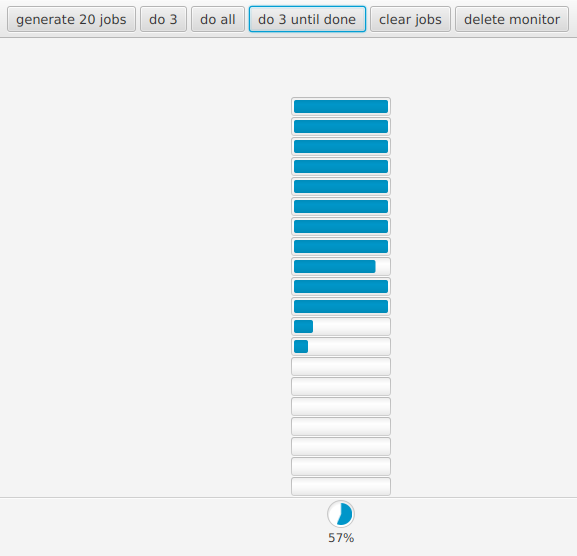

# cljfx job widget

From the REPL:

    (start)

To start the GUI:



It will watch `joblib/-queue` for changes and update itself.

Click `generate 20 jobs` to add 20 dummy jobs to the queue that tick down the seconds until they're done.

Click `do 3` to start 3 jobs in parallel.

Click `do all` to start the remaining jobs in parallel.

Click `clear jobs` to remove the jobs from the queue.

Click `generate 20 jobs` to add another 20 dummy jobs to the queue.

Click `do 3 until done` to add a monitor that processes 3 jobs in parallel until all jobs are done.

Click `generate 20 jobs` and see 3 jobs taken in parallel again, until all jobs are done.

Click `delete monitor` to stop jobs being automatically processed.

From the CLI:

```clojure
;; bring up the gui
(start)

;; add 20 dummy jobs to the queue that tick down the seconds until they're done
(run! joblib/create-job-add-to-queue! (gen-fns 20))

;; run *all* the dummy jobs
(joblib/start-jobs-in-queue!)

;; or, run just the first 3 jobs
(joblib/start-jobs-in-queue! 3)

;; or, create a monitor that watches the queue and ensures there are always 3 jobs running
(joblib/monitor! 3)

;; to stop the monitor from consuming jobs, keep a reference to it:
(def kill-monitor (joblib/monitor! 3))

;; and then call it when you're done:
(kill-monitor)

;; fetch results from the queue with:
(joblib/all-job-results)

;; or, fetch and remove the jobs from the queue with:
;; (this returns *all* of job information, not just job results)
(joblib/pop-all-jobs!)
```
